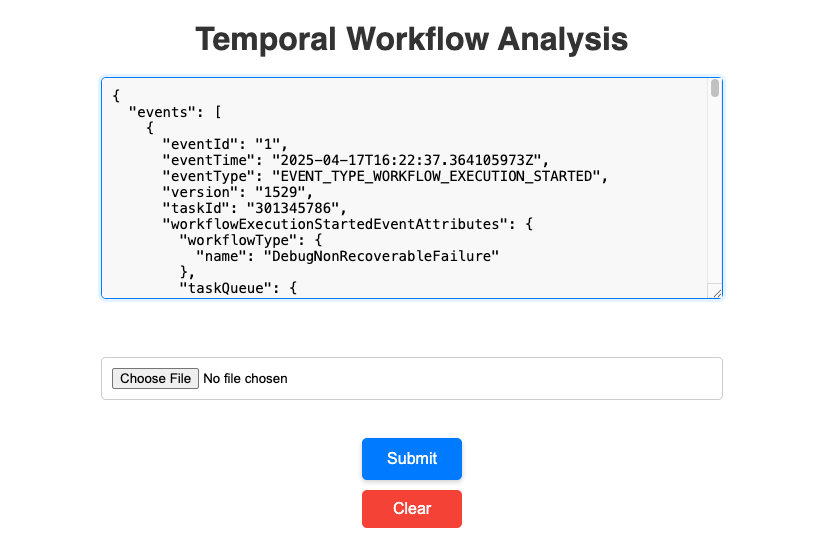
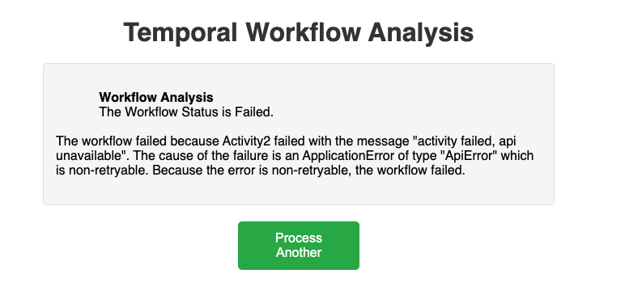

# temporal-workflow-history-analysis
Leverages Gemini 2.0 Flash model to analyze workflow histories. Supports the following scenarios:

* Failing Activities 
  * Activity Retries > 5
  * Failures due to business reasons
* Failing Workflow Tasks
  * Bugs in Code
  * Non-Determinism Errors
  * Potential Deadlocks Detected

## Install
Requires [Poetry](https://python-poetry.org/) to manage dependencies.

1. `python -m venv venv`

2. `source venv/bin/activate`

3. `poetry install`

## Set up your environment
Copy the env.example file to env

```bash
cp env.example .env
```

Modify the .env file to include your [Gemini API Key](https://ai.google.dev/gemini-api/docs/api-key). 

```text
GEN_AI_KEY=<Your Gemini API Key Goes Here>
```

## Run the web application

```bash
poetry run python app.py
```

Then navigate to http://127.0.0.1:500

Copy/Paste an existing workflow history after downloading it from the Temporal UI



After submitting the JSON, you will see something similar to this:


